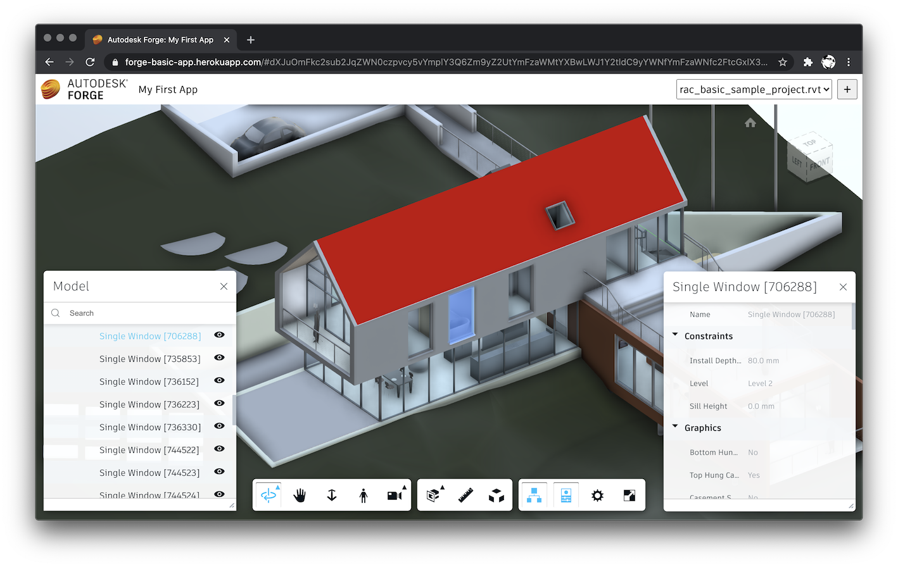

# basic-forge-app-aspnet

Simple ASP.NET application accessing the Autodesk Forge platform.

## Prerequisites

- [Forge application credentials](https://forge.autodesk.com/en/docs/oauth/v2/tutorials/create-app)

## Setup

- Clone this repository
- Create a copy of the _appsettings.json_ file and call it _appsettings.Development.json_
- In the _appsettings.Development.json_ file:
  - Set `ForgeClientID` to your Forge app's client ID
  - Set `ForgeClientSecret` to your Forge app's client secret
  - Set `ForgeBucket` to a name of a bucket where your designs will be stored
    - For naming requirements, please refer to https://forge.autodesk.com/en/docs/data/v2/reference/http/buckets-POST/#body-structure
    - Since the bucket name must be globally unique, we recommend including your (lower-case) Forge client ID in it

## Run

- Open the project in Visual Studio
- Run and debug the ASP.NET application using IIS Express